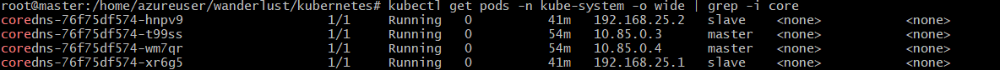

# Kubernetes Deployment for Wanderlust

This guide details the steps required to deploy the Wanderlust application on a Kubernetes cluster using EC2 instances.

## Prerequisites

- Access to a Kubernetes cluster with nodes in a **Ready** state.
- Docker installed on the system.
- DockerHub account credentials.
- Kubernetes CLI (`kubectl`) installed and configured.

## Deployment Steps

### 1. Become Root User

```bash
sudo su
```

### 2. Clone the Repository

```bash
git clone -b devops https://github.com/DevMadhup/wanderlust.git
```

### 3. Verify Kubernetes Nodes

Ensure all nodes are in the **Ready** state:

```bash
kubectl get nodes
```

### 4. Create Kubernetes Namespace

```bash
kubectl create namespace wanderlust
```

### 5. Update Kubernetes Context

Set the current context to the newly created namespace:

```bash
kubectl config set-context --current --namespace wanderlust
```

### 6. Enable DNS Resolution on the Cluster

Check if the CoreDNS pods are running:

```bash
kubectl get pods -n kube-system -o wide | grep -i core
```


If necessary, increase the replica count for CoreDNS to 4:

```bash
kubectl edit deploy coredns -n kube-system -o yaml
# Change the replica count from 2 to 4
```

### 7. Build and Push Docker Images

#### Frontend

1. Navigate to the `frontend` directory:

    ```bash
    cd frontend
    ```

2. Edit the `.env.docker` file, replacing the public IP address with your worker node's public IP:

    ```bash
    vi .env.docker
    ```

3. Build the frontend Docker image:
    ```bash
    # Enter your docker username instead of manjesh501
    docker build -t manjesh501/frontend-wanderlust:v2.1.8 .
    ```

#### Backend

1. Navigate to the `backend` directory:

    ```bash
    cd ../backend/
    ```

2. Edit the `.env.docker` file with the correct values for the following variables:

    ```bash
    vi .env.docker
    ```

    - `MONGODB_URI`: Your MongoDB service name.
    - `REDIS_URL`: Your Redis service name.
    - `FRONTEND_URL`: Your worker node's public IP.

    Note: Check `mongodb.yaml` and `redis.yaml` files for service names.

3. Build the backend Docker image:

    ```bash
    docker build -t manjesh501/backend-wanderlust:v2.1.8 .
    ```

4. Verify the Docker images:

    ```bash
    docker images
    ```
    

5. Login to DockerHub and push the images:

    ```bash
    docker login
    docker push manjesh501/frontend-wanderlust:v2.1.8
    docker push manjesh501/backend-wanderlust:v2.1.8
    ```

### 8. Deploy Application on Kubernetes

1. Navigate to the `kubernetes` directory:

    ```bash
    cd ../kubernetes
    ```

2. Apply Kubernetes manifests in the following order:

    - **Persistent Volume:**

        ```bash
        kubectl apply -f persistentVolume.yaml
        ```

    - **Persistent Volume Claim:**

        ```bash
        kubectl apply -f persistentVolumeClaim.yaml
        ```

    - **MongoDB Deployment and Service:**

        ```bash
        kubectl apply -f mongodb.yaml
        ```

    - **Redis Deployment and Service:**
    
        Wait for 3-4 minutes for MongoDB and Redis pods and services to be up.

        ```bash
        kubectl apply -f redis.yaml
        ```

    - **Backend Deployment and Service:**

        ```bash
        kubectl apply -f backend.yaml
        ```

    - **Frontend Deployment and Service:**

        ```bash
        kubectl apply -f frontend.yaml
        ```

3. Verify all deployments and services:

    ```bash
    kubectl get all
    ```
    

4. Check logs for all pods:

    ```bash
    kubectl logs <pod-name>
    ```

### 9. Access the Application

Open your browser and access the application at port `31000`:

```plaintext
http://<your-workernode-publicip>:31000/
```


---

### 10. Clean Up
Terminate all the instances and services once done
